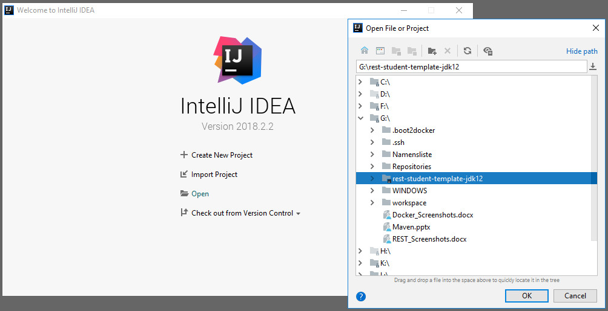
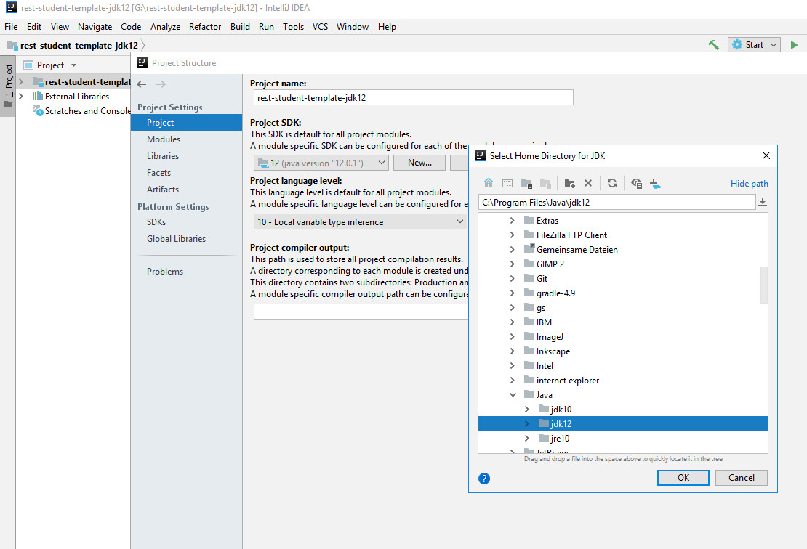

# Verteilte Systeme: RESTful Webservices

## Aufgabenstellung

Dies ist ein Projekt-Template für Ihre erste RESTful-Webservice-Applikation rund um die CRUD-Methoden der Ressource (Entity) *Student*.

Die Aufgabenstellung finden Sie [hier](AUFGABENSTELLUNG.md).

## Installation des Templates

> **Achtung**  Dieses Template ist nur gültig für *OpenJdk12*, *git* und die *IntelliJ IDEA* innerhalb der CIP-Pools im K-Gebäude!

1. Navigieren Sie zu einem Ordner Ihrer Wahl, in dem Sie das Projekt erstellen möchten
2. Öffnen Sie die Konsole (Windows Eingabeaufforderung *cmd*, Windows *PowerShell*, Mac *Terminal*)
3. Klonen Sie das Projekt (Template) mittels `git clone http://im-lamport:1080/vs/rest-student-template-jdk12.git`; alternativ können Sie sich das Projekt aus gezippt herunterladen, nutzen Sie hierzu den Download-Button oben (in diesem Fall bitte beachten, dass das eigentliche Projektverzeichnis nochmals in einem Verzeichnis kopiert wird; zu öffnen ist das "innere" Verzeichnis!)
4. Starten Sie IntelliJ IDEA
5. Wählen Sie *Open* (nicht *Import*!) und wählen Sie das neu geklonte/kopierte Projektverzeichnis "rest-student-template-jdk12" aus

6. Stellen Sie nun noch das JDK/SDK für Ihr Projekt ein. Öffnen Sie dazu die "Module Settings" durch rechten Mausklick auf den Projekt-Root-Ordner "rest-student-template-jdk12" und wählen Sie "Open Module Settings". Im Tab "Project" wählen Sie das SDK aus ("OpenJDK 12" in den CIP-Pools, Pfad `C:\Program Files\Java\jdk12`, siehe nachfolgendes Beispiel ) oder legen Sie entsprechend einen neuen SDK-Eintrag an. Beispiel:

Um dieses Template auch auf Ihrem privaten Rechner nutzen zu können müssen Sie dieses Projekt auf Ihr jeweiliges JDK anpassen:
1. Passen Sie die SDK-Einstellungen entsprechend dem installierten JDK Ihres Rechners an (siehe oben), Sie müssen auf Ihrem lokalen Rechner mindestens die JDK-Version 10 installiert haben
2. Ändern Sie die Konfigurationsdatei `pom.xml` entsprechend der darin gesetzten Kommentare ab (Änderungen an drei Stellen)

## JAX-RS 2.1 RESTful Webservices in Java mit JAX-RS und Jersey

Die [JAX-RS 2.1 Spezification](https://github.com/jax-rs) spezifiziert die Unterstützung von RESTful-Webservice-APIs. 

[Jersey](https://jersey.github.io) ist die zugehörige JAX-RS-Referenzimplementierung für eine konkrete Umsetzung. Nutzen Sie die Dokumentationsseiten und weitere Suchergebnisse im Netz zu diesen Themen, sofern Sie sich mit dieser Thematik tiefer befassen möchten.

## JAX-RS Clients

JAX-RS bietet natürlich auch API-Klassen an, um eine Client-Anwendung in Java zu implemenieren. 

Im Rahmen der Übungen werden zur Vereinfachung aber nur Browser-Plugins als generische Client verwendet. Installieren Sie hierzu ein passendes Plugin für Ihren Browser, z. B.  [RESTer for Crome](https://chrome.google.com/webstore/detail/rester/eejfoncpjfgmeleakejdcanedmefagga?hl=en) oder für [Firefox](https://addons.mozilla.org/en-US/firefox/addon/rester/).
 

